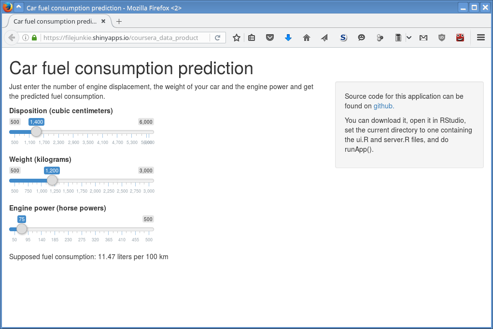

## Introduction

* Fuel consumption is an important parameter of a car, and its importance is growing nowadays
* This value can be dependent on many parameters
* This work investigates this and tries to predict the fuel consumption

---

## Approach used

The approach used in this work is linear models, which are built on top of standard `mtcars` R data frame.

One of the features of this data frame is usage of the U.S. measurement system instead of metric one, so to use metric ssytem, conversions should be applied.

```{r}
model <- lm(mpg ~ disp + wt + hp, data = mtcars)

# accepts cm^3, kilograms and horsepowers, returns liters / 100 km
predictConsumption <<- function(disp, wt, hp){
  dispCubInch <- disp / 16.3871
  wtThousandsPounds <- wt * 2.20462 / 1000

  mpg <- predict(model, data.frame(disp = dispCubInch, wt = wtThousandsPounds, hp = hp))[[1]]
  return(282.5 / mpg)
}
```

---

## Example graph

As an example of using this prediction function, let's show the graph of the fuel consumption for a Volkswagen Golf II with 1.3 Engine (1272 cubic centimeters, 55 hp) if it would have different weights (its real curb weight is between 910 and 1245 kilograms).

```{r, echo=FALSE, fig.height = 5}
wt <- seq(700, 1500, 100)
disp <- 1272
hp <- 55
fuel <- sapply(wt, function(x) predictConsumption(disp, x, hp))
data <- data.frame(Weight = wt, Fuel = fuel)

library(ggplot2)
g <- ggplot(data = data, aes(x = Weight, y = Fuel))
g <- g + geom_point()
g <- g + geom_smooth()
g <- g + labs(x = "Weight, kilograms", y = "Fuel consumption, liters pers 100 km")
g

```

---

## Shiny Application

The resulting data application is implemented using Shiny and accessible using this link: https://filejunkie.shinyapps.io/coursera_data_products_course_project/


